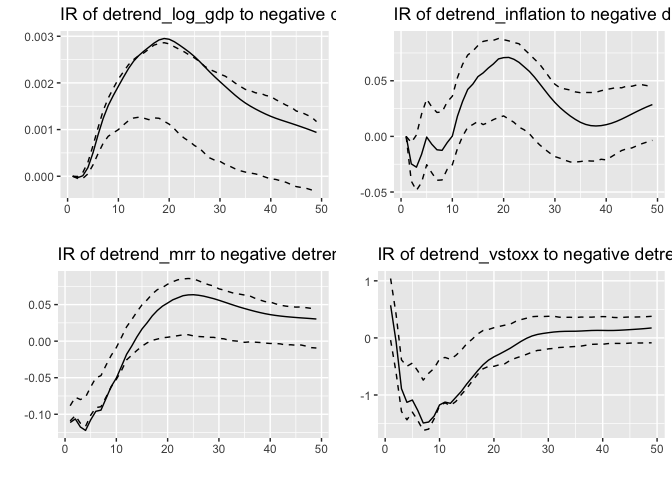
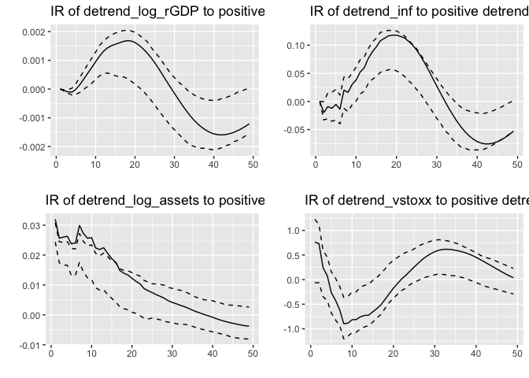

The effects of (un)conventional monetary policy on the euro area
================

We want to take a look at the IRFs (Impulse Response Functions) to
compare the effects of conventional and unconventional monetary policy
of the ECB. The former is represented by the Main Refinancing Rate
whereas the latter is represented by the balance sheet of the ECB. The
effects are supposed to be shown on the variables real GPD, inflation
and the STOXX 50 volatility index. Time period is selected to be from
January 2000 until February 2018. So we have enough crisis as well as
non-crisis years.

## Import libraries

``` r
library(zoo)
library(xts)
library(RiverLoad)
library(vars)
library(tseries)
library(aTSA)
library(xtable)
library(dynlm)
library(car)
library(ggplot2)
library(gridExtra)
```

## Import datasets

**Main Refinancing Rate (MRR)**

``` r
mrr <- read.csv('BBK01.SU0202.csv', header = TRUE, sep = ',')
head(mrr, 10)
```

    ##                  X
    ## 1                 
    ## 2             unit
    ## 3  unit multiplier
    ## 4      last update
    ## 5          1999-01
    ## 6          1999-02
    ## 7          1999-03
    ## 8          1999-04
    ## 9          1999-05
    ## 10         1999-06
    ##                                                         BBK01.SU0202
    ## 1  ECB interest rates for main refinancing operations / End of month
    ## 2                                                             % P.A.
    ## 3                                                                one
    ## 4                                                2019-05-31 13:54:48
    ## 5                                                               3.00
    ## 6                                                               3.00
    ## 7                                                               3.00
    ## 8                                                               2.50
    ## 9                                                               2.50
    ## 10                                                              2.50
    ##    BBK01.SU0202_FLAGS
    ## 1                    
    ## 2                    
    ## 3                    
    ## 4                    
    ## 5             comment
    ## 6             comment
    ## 7             comment
    ## 8             comment
    ## 9                    
    ## 10

**ECB balance sheet**

``` r
assets <- read.csv('ECBASSETS.csv', header = TRUE, sep = ',')
head(assets)
```

    ##         DATE ECBASSETS
    ## 1 1998-12-01    697160
    ## 2 1999-01-01    694638
    ## 3 1999-02-01    692641
    ## 4 1999-03-01    699396
    ## 5 1999-04-01    698296
    ## 6 1999-05-01    705060

**Real GDP**

``` r
gdp <- read.csv('CLVMEURSCAB1GQEA19.csv', header = TRUE, sep = ',')
head(gdp)
```

    ##         DATE CLVMEURSCAB1GQEA19
    ## 1 1995-01-01            1837565
    ## 2 1995-04-01            1848280
    ## 3 1995-07-01            1853638
    ## 4 1995-10-01            1859266
    ## 5 1996-01-01            1861473
    ## 6 1996-04-01            1874735

**Inflation**

``` r
inf <- read.csv('DP_LIVE_21102019152317061.csv', header = TRUE, sep = ',')
head(inf)
```

    ##   LOCATION INDICATOR SUBJECT MEASURE FREQUENCY    TIME    Value Flag.Codes
    ## 1      AUT       CPI     TOT  AGRWTH         M 2000-01 1.149740           
    ## 2      AUT       CPI     TOT  AGRWTH         M 2000-02 1.639344           
    ## 3      AUT       CPI     TOT  AGRWTH         M 2000-03 1.939891           
    ## 4      AUT       CPI     TOT  AGRWTH         M 2000-04 1.857923           
    ## 5      AUT       CPI     TOT  AGRWTH         M 2000-05 1.745296           
    ## 6      AUT       CPI     TOT  AGRWTH         M 2000-06 2.732240

**VSTOXX**

``` r
stoxx50 <- read.csv('stoxx.csv', header = TRUE, sep = ';')
head(stoxx50)
```

    ##       Date Symbol Indexvalue
    ## 1 04.01.99   V2TX    18.2033
    ## 2 05.01.99   V2TX    29.6912
    ## 3 06.01.99   V2TX     25.167
    ## 4 07.01.99   V2TX    32.5205
    ## 5 08.01.99   V2TX    33.2296
    ## 6 11.01.99   V2TX    36.8411

## Adjusting datasets

We have to adjust the datasets to obtain monthly data in the period from
January 2000 until February 2018. Real GDP is available as quarterly
data. So we have to apply interpolation in this case. The STOXX 50
variable on the other hand is based on daily data. We take the mean of
each month in that case. The inflation dataset contains the inflation
data on every country in Europe. However, we only need the inflation
data of the 19 countries in the euro area.

**MRR**

``` r
mrr <- mrr[17:234, c('X', 'BBK01.SU0202')]
colnames(mrr) <- c('Time', 'MRR')
```

**Assets**

``` r
colnames(assets) <- c('Date', 'Assets')
assets <- assets[14:231,]
```

**Real GDP**

``` r
colnames(gdp) <- c('Date', 'GDP')
gdp$Date <- as.Date(gdp$Date)
gdp$quarter <- as.yearqtr(gdp$Date, format = "%Y%q")

monthly = seq(gdp$Date[1], tail(gdp$Date,1), by="month")
realGDP2 = data.frame(qvar=monthly, gdp2=spline(gdp, method="fmm", xout=monthly)$y)
colnames(realGDP2) <- c('Date', 'rGDP')

gdp <- realGDP2[61:278,]
```

**Inflation**

``` r
inf <- subset(inf, inf == 'EA19')
inf <- inf[1:218, c('TIME', 'Value')]
```

**VSTOXX**

``` r
StoxxDate <- as.Date(stoxx50$Date, format = '%d.%m.%y')
stoxx <- data.frame(StoxxDate, stoxx50$Indexvalue)

stoxx$stoxx50.Indexvalue <- as.numeric(stoxx$stoxx50.Indexvalue)
```

    ## Warning: NAs durch Umwandlung erzeugt

``` r
colnames(stoxx) <- c('datetime', 'flow')
stoxx <- monthly.year.mean(stoxx)

colnames(stoxx) <- c('Date', 'IndexValue')

NewDate <- format(stoxx$Date, '%Y-%m')
stoxx <- data.frame(NewDate, stoxx$IndexValue)
colnames(stoxx) <- c('Date', 'IndexValue')
vstoxx <- stoxx[13:230,]
```

### Converting to Time Series format

``` r
mrr <- ts(mrr$MRR, start = 2000, frequency = 12)
assets <- ts(assets$Assets, start = 2000, frequency = 12)
gdp <- ts(gdp$rGDP, start = 2000, frequency = 12)
inf <- ts(inf$Value, start = 2000, frequency = 12)
vstoxx <- ts(vstoxx$IndexValue, start = 2000, frequency = 12)
```

## Analysis

We are using a Vector Autoregressive Model for our purpose whose results
we do not want to interpret directly but with the use of Impulse
Response Functions. With IRFs we can examine the effects of an unit
shock in the size of one standard deviation of the respective error term
while holding all other shocks constant. We need to make sure that we
use (weakly) stationary time series in our model. Stationarity refers to
the characteristic that the distribution function of a process does not
change by a shift in time. Economic time series often include a
deterministic trend which need to be removed to obtain stationary time
series. When detrending one time series, it is advisable to detrend all
time series in the model for interpretation reasons. Also, we take the
logarithmic values of GDP and assets because of their magnitude.

**Taking the logarithm**

``` r
log_assets <- log(assets)
log_gdp <- log(gdp)
```

**Detrending linearly**

``` r
trend_mrr <- lm(mrr ~ c(1:length(mrr)))
detrend_mrr <- resid(trend_mrr)

trend_log_assets <- lm(log_assets ~ c(1:length(log_assets)))
detrend_log_assets <- resid(trend_log_assets)

trend_log_gdp <- lm(log_gdp ~ c(1:length(log_gdp)))
detrend_log_gdp <- resid(trend_log_gdp)

trend_inf <- lm(inf ~ c(1:length(inf)))
detrend_inf <- resid(trend_inf)

trend_vstoxx <- lm(vstoxx ~ c(1:length(vstoxx)))
detrend_vstoxx <- resid(trend_vstoxx)
```

**Stationary testing**

``` r
VARselect(detrend_log_gdp, lag.max = 12)
```

    ## $selection
    ## AIC(n)  HQ(n)  SC(n) FPE(n) 
    ##      9      9      9      9 
    ## 
    ## $criteria
    ##                    1             2             3             4             5
    ## AIC(n) -1.236542e+01 -1.455319e+01 -1.535575e+01 -1.567757e+01 -1.572097e+01
    ## HQ(n)  -1.235235e+01 -1.453359e+01 -1.532961e+01 -1.564491e+01 -1.568177e+01
    ## SC(n)  -1.233311e+01 -1.450473e+01 -1.529113e+01 -1.559680e+01 -1.562404e+01
    ## FPE(n)  4.263509e-06  4.782227e-07  2.143310e-07  1.553531e-07  1.487568e-07
    ##                    6             7             8             9            10
    ## AIC(n) -1.589534e+01 -1.589307e+01 -1.595723e+01 -1.600593e+01 -1.599889e+01
    ## HQ(n)  -1.584960e+01 -1.584080e+01 -1.589842e+01 -1.594059e+01 -1.592702e+01
    ## SC(n)  -1.578225e+01 -1.576383e+01 -1.581183e+01 -1.584438e+01 -1.582119e+01
    ## FPE(n)  1.249554e-07  1.252408e-07  1.174597e-07  1.118789e-07  1.126714e-07
    ##                   11            12
    ## AIC(n) -1.599741e+01 -1.598863e+01
    ## HQ(n)  -1.591901e+01 -1.590369e+01
    ## SC(n)  -1.580355e+01 -1.577862e+01
    ## FPE(n)  1.128420e-07  1.138411e-07

``` r
VARselect(detrend_inf, lag.max = 12)
```

    ## $selection
    ## AIC(n)  HQ(n)  SC(n) FPE(n) 
    ##      8      3      3      8 
    ## 
    ## $criteria
    ##                  1           2           3           4           5           6
    ## AIC(n) -2.73004834 -2.75793813 -2.78455580 -2.77525998 -2.77711274 -2.76740536
    ## HQ(n)  -2.71698130 -2.73833756 -2.75842172 -2.74259237 -2.73791162 -2.72167071
    ## SC(n)  -2.69773886 -2.70947391 -2.71993685 -2.69448628 -2.68018431 -2.65432219
    ## FPE(n)  0.06521618  0.06342253  0.06175682  0.06233386  0.06221891  0.06282645
    ##                  7           8           9          10          11          12
    ## AIC(n) -2.76877727 -2.80712310 -2.80221433 -2.80540406 -2.79684374 -2.79243156
    ## HQ(n)  -2.71650910 -2.74832141 -2.73687911 -2.73353533 -2.71844149 -2.70749578
    ## SC(n)  -2.63953936 -2.66173045 -2.64066694 -2.62770194 -2.60298688 -2.58241995
    ## FPE(n)  0.06274112  0.06038181  0.06068019  0.06048848  0.06101035  0.06128234

``` r
VARselect(detrend_mrr, lag.max = 12)
```

    ## $selection
    ## AIC(n)  HQ(n)  SC(n) FPE(n) 
    ##      4      4      4      4 
    ## 
    ## $criteria
    ##                  1           2           3           4           5           6
    ## AIC(n) -3.92378419 -4.00342137 -4.10381739 -4.12263432 -4.11295988 -4.10427187
    ## HQ(n)  -3.91071714 -3.98382081 -4.07768330 -4.08996672 -4.07375875 -4.05853722
    ## SC(n)  -3.89147471 -3.95495716 -4.03919843 -4.04186063 -4.01603145 -3.99118870
    ## FPE(n)  0.01976617  0.01825312  0.01650961  0.01620193  0.01635955  0.01650246
    ##                  7           8           9          10         11         12
    ## AIC(n) -4.11715934 -4.10752369 -4.10415061 -4.09476411 -4.0978103 -4.0889519
    ## HQ(n)  -4.06489117 -4.04872200 -4.03881539 -4.02289537 -4.0194081 -4.0040162
    ## SC(n)  -3.98792143 -3.96213104 -3.94260322 -3.91706198 -3.9039534 -3.8789403
    ## FPE(n)  0.01629136  0.01644937  0.01650529  0.01666137  0.0166112  0.0167596

``` r
VARselect(detrend_log_assets, lag.max = 12)
```

    ## $selection
    ## AIC(n)  HQ(n)  SC(n) FPE(n) 
    ##     11      7      1     11 
    ## 
    ## $criteria
    ##                   1            2            3            4            5
    ## AIC(n) -6.580801880 -6.571139390 -6.571113454 -6.576337671 -6.567052505
    ## HQ(n)  -6.567734837 -6.551538826 -6.544979369 -6.543670064 -6.527851377
    ## SC(n)  -6.548492402 -6.522675174 -6.506494499 -6.495563977 -6.470124072
    ## FPE(n)  0.001386738  0.001400204  0.001400244  0.001392955  0.001405958
    ##                   6           7            8            9           10
    ## AIC(n) -6.557917617 -6.63834002 -6.633411141 -6.628722288 -6.634618446
    ## HQ(n)  -6.512182968 -6.58607185 -6.574609449 -6.563387075 -6.562749712
    ## SC(n)  -6.444834446 -6.50910211 -6.488018493 -6.467174901 -6.456916320
    ## FPE(n)  0.001418874  0.00130925  0.001315741  0.001321952  0.001314214
    ##                 11           12
    ## AIC(n) -6.64479266 -6.636078270
    ## HQ(n)  -6.56639040 -6.551142493
    ## SC(n)  -6.45093580 -6.426066667
    ## FPE(n)  0.00130095  0.001312384

``` r
VARselect(detrend_vstoxx, lag.max = 12)
```

    ## $selection
    ## AIC(n)  HQ(n)  SC(n) FPE(n) 
    ##      3      1      1      3 
    ## 
    ## $criteria
    ##                1         2         3         4         5         6         7
    ## AIC(n)  3.051501  3.046672  3.046262  3.051314  3.050434  3.052533  3.053564
    ## HQ(n)   3.064568  3.066272  3.072396  3.083981  3.089636  3.098267  3.105832
    ## SC(n)   3.083810  3.095136  3.110881  3.132087  3.147363  3.165616  3.182802
    ## FPE(n) 21.147067 21.045228 21.036662 21.143302 21.124867 21.169444 21.191568
    ##                8         9        10        11        12
    ## AIC(n)  3.063018  3.072644  3.079610  3.087822  3.095372
    ## HQ(n)   3.121820  3.137979  3.151478  3.166225  3.180308
    ## SC(n)   3.208411  3.234191  3.257312  3.281679  3.305384
    ## FPE(n) 21.393216 21.600575 21.752121 21.932168 22.099173

We look at the information criteria in order to assign an appropriate
lag order to the respective time series.

``` r
adf.test(detrend_log_gdp, nlag = 12)
```

    ## Augmented Dickey-Fuller Test 
    ## alternative: stationary 
    ##  
    ## Type 1: no drift no trend 
    ##       lag   ADF p.value
    ##  [1,]   0 -1.03  0.3103
    ##  [2,]   1 -3.80  0.0100
    ##  [3,]   2 -1.56  0.1195
    ##  [4,]   3 -2.52  0.0129
    ##  [5,]   4 -3.28  0.0100
    ##  [6,]   5 -2.15  0.0332
    ##  [7,]   6 -2.19  0.0296
    ##  [8,]   7 -2.73  0.0100
    ##  [9,]   8 -2.15  0.0325
    ## [10,]   9 -1.99  0.0464
    ## [11,]  10 -2.02  0.0444
    ## [12,]  11 -2.06  0.0407
    ## Type 2: with drift no trend 
    ##       lag   ADF p.value
    ##  [1,]   0 -1.03  0.6872
    ##  [2,]   1 -3.79  0.0100
    ##  [3,]   2 -1.56  0.5005
    ##  [4,]   3 -2.51  0.1278
    ##  [5,]   4 -3.27  0.0192
    ##  [6,]   5 -2.14  0.2730
    ##  [7,]   6 -2.18  0.2569
    ##  [8,]   7 -2.72  0.0764
    ##  [9,]   8 -2.15  0.2701
    ## [10,]   9 -1.99  0.3326
    ## [11,]  10 -2.01  0.3236
    ## [12,]  11 -2.05  0.3068
    ## Type 3: with drift and trend 
    ##       lag   ADF p.value
    ##  [1,]   0 -1.03  0.9319
    ##  [2,]   1 -3.78  0.0210
    ##  [3,]   2 -1.56  0.7616
    ##  [4,]   3 -2.50  0.3656
    ##  [5,]   4 -3.25  0.0794
    ##  [6,]   5 -2.14  0.5176
    ##  [7,]   6 -2.17  0.5030
    ##  [8,]   7 -2.70  0.2809
    ##  [9,]   8 -2.13  0.5183
    ## [10,]   9 -1.97  0.5868
    ## [11,]  10 -1.98  0.5829
    ## [12,]  11 -2.04  0.5588
    ## ---- 
    ## Note: in fact, p.value = 0.01 means p.value <= 0.01

``` r
adf.test(detrend_inf, nlag = 12)
```

    ## Augmented Dickey-Fuller Test 
    ## alternative: stationary 
    ##  
    ## Type 1: no drift no trend 
    ##       lag   ADF p.value
    ##  [1,]   0 -2.41  0.0177
    ##  [2,]   1 -2.80  0.0100
    ##  [3,]   2 -3.23  0.0100
    ##  [4,]   3 -3.24  0.0100
    ##  [5,]   4 -3.48  0.0100
    ##  [6,]   5 -3.26  0.0100
    ##  [7,]   6 -3.55  0.0100
    ##  [8,]   7 -4.32  0.0100
    ##  [9,]   8 -3.76  0.0100
    ## [10,]   9 -4.07  0.0100
    ## [11,]  10 -4.02  0.0100
    ## [12,]  11 -4.12  0.0100
    ## Type 2: with drift no trend 
    ##       lag   ADF p.value
    ##  [1,]   0 -2.40  0.1708
    ##  [2,]   1 -2.79  0.0651
    ##  [3,]   2 -3.23  0.0212
    ##  [4,]   3 -3.24  0.0207
    ##  [5,]   4 -3.48  0.0100
    ##  [6,]   5 -3.25  0.0202
    ##  [7,]   6 -3.54  0.0100
    ##  [8,]   7 -4.31  0.0100
    ##  [9,]   8 -3.75  0.0100
    ## [10,]   9 -4.06  0.0100
    ## [11,]  10 -4.01  0.0100
    ## [12,]  11 -4.11  0.0100
    ## Type 3: with drift and trend 
    ##       lag   ADF p.value
    ##  [1,]   0 -2.40  0.4085
    ##  [2,]   1 -2.79  0.2446
    ##  [3,]   2 -3.22  0.0851
    ##  [4,]   3 -3.24  0.0826
    ##  [5,]   4 -3.48  0.0454
    ##  [6,]   5 -3.24  0.0812
    ##  [7,]   6 -3.54  0.0392
    ##  [8,]   7 -4.31  0.0100
    ##  [9,]   8 -3.75  0.0225
    ## [10,]   9 -4.05  0.0100
    ## [11,]  10 -4.01  0.0100
    ## [12,]  11 -4.11  0.0100
    ## ---- 
    ## Note: in fact, p.value = 0.01 means p.value <= 0.01

``` r
adf.test(detrend_mrr, nlag = 12)
```

    ## Augmented Dickey-Fuller Test 
    ## alternative: stationary 
    ##  
    ## Type 1: no drift no trend 
    ##       lag   ADF p.value
    ##  [1,]   0 -1.65  0.0944
    ##  [2,]   1 -1.96  0.0494
    ##  [3,]   2 -2.43  0.0166
    ##  [4,]   3 -3.02  0.0100
    ##  [5,]   4 -3.05  0.0100
    ##  [6,]   5 -2.73  0.0100
    ##  [7,]   6 -3.03  0.0100
    ##  [8,]   7 -3.05  0.0100
    ##  [9,]   8 -2.75  0.0100
    ## [10,]   9 -2.69  0.0100
    ## [11,]  10 -2.91  0.0100
    ## [12,]  11 -2.78  0.0100
    ## Type 2: with drift no trend 
    ##       lag   ADF p.value
    ##  [1,]   0 -1.65  0.4643
    ##  [2,]   1 -1.95  0.3461
    ##  [3,]   2 -2.43  0.1607
    ##  [4,]   3 -3.01  0.0380
    ##  [5,]   4 -3.05  0.0345
    ##  [6,]   5 -2.73  0.0760
    ##  [7,]   6 -3.02  0.0372
    ##  [8,]   7 -3.04  0.0350
    ##  [9,]   8 -2.75  0.0730
    ## [10,]   9 -2.69  0.0829
    ## [11,]  10 -2.91  0.0474
    ## [12,]  11 -2.77  0.0686
    ## Type 3: with drift and trend 
    ##       lag   ADF p.value
    ##  [1,]   0 -1.65   0.722
    ##  [2,]   1 -1.95   0.596
    ##  [3,]   2 -2.42   0.399
    ##  [4,]   3 -3.00   0.156
    ##  [5,]   4 -3.03   0.142
    ##  [6,]   5 -2.71   0.277
    ##  [7,]   6 -3.00   0.154
    ##  [8,]   7 -3.03   0.144
    ##  [9,]   8 -2.73   0.267
    ## [10,]   9 -2.68   0.292
    ## [11,]  10 -2.91   0.195
    ## [12,]  11 -2.77   0.252
    ## ---- 
    ## Note: in fact, p.value = 0.01 means p.value <= 0.01

``` r
adf.test(detrend_log_assets, nlag = 12)
```

    ## Augmented Dickey-Fuller Test 
    ## alternative: stationary 
    ##  
    ## Type 1: no drift no trend 
    ##       lag   ADF p.value
    ##  [1,]   0 -1.88  0.0610
    ##  [2,]   1 -1.78  0.0760
    ##  [3,]   2 -1.98  0.0478
    ##  [4,]   3 -2.23  0.0259
    ##  [5,]   4 -2.12  0.0356
    ##  [6,]   5 -2.22  0.0270
    ##  [7,]   6 -2.87  0.0100
    ##  [8,]   7 -2.98  0.0100
    ##  [9,]   8 -3.18  0.0100
    ## [10,]   9 -2.73  0.0100
    ## [11,]  10 -3.07  0.0100
    ## [12,]  11 -2.89  0.0100
    ## Type 2: with drift no trend 
    ##       lag   ADF p.value
    ##  [1,]   0 -1.87  0.3776
    ##  [2,]   1 -1.77  0.4165
    ##  [3,]   2 -1.97  0.3389
    ##  [4,]   3 -2.23  0.2396
    ##  [5,]   4 -2.11  0.2835
    ##  [6,]   5 -2.21  0.2437
    ##  [7,]   6 -2.86  0.0537
    ##  [8,]   7 -2.97  0.0416
    ##  [9,]   8 -3.18  0.0235
    ## [10,]   9 -2.73  0.0756
    ## [11,]  10 -3.07  0.0319
    ## [12,]  11 -2.89  0.0496
    ## Type 3: with drift and trend 
    ##       lag   ADF p.value
    ##  [1,]   0 -1.86  0.6320
    ##  [2,]   1 -1.77  0.6735
    ##  [3,]   2 -1.96  0.5902
    ##  [4,]   3 -2.22  0.4836
    ##  [5,]   4 -2.11  0.5304
    ##  [6,]   5 -2.21  0.4874
    ##  [7,]   6 -2.85  0.2170
    ##  [8,]   7 -2.97  0.1706
    ##  [9,]   8 -3.17  0.0935
    ## [10,]   9 -2.73  0.2712
    ## [11,]  10 -3.07  0.1271
    ## [12,]  11 -2.89  0.2041
    ## ---- 
    ## Note: in fact, p.value = 0.01 means p.value <= 0.01

``` r
adf.test(detrend_vstoxx, nlag = 12)
```

    ## Augmented Dickey-Fuller Test 
    ## alternative: stationary 
    ##  
    ## Type 1: no drift no trend 
    ##       lag   ADF p.value
    ##  [1,]   0 -3.90    0.01
    ##  [2,]   1 -4.24    0.01
    ##  [3,]   2 -3.67    0.01
    ##  [4,]   3 -3.80    0.01
    ##  [5,]   4 -3.29    0.01
    ##  [6,]   5 -3.49    0.01
    ##  [7,]   6 -3.08    0.01
    ##  [8,]   7 -2.95    0.01
    ##  [9,]   8 -2.90    0.01
    ## [10,]   9 -2.96    0.01
    ## [11,]  10 -3.00    0.01
    ## [12,]  11 -2.78    0.01
    ## Type 2: with drift no trend 
    ##       lag   ADF p.value
    ##  [1,]   0 -3.89  0.0100
    ##  [2,]   1 -4.23  0.0100
    ##  [3,]   2 -3.67  0.0100
    ##  [4,]   3 -3.79  0.0100
    ##  [5,]   4 -3.28  0.0188
    ##  [6,]   5 -3.48  0.0100
    ##  [7,]   6 -3.07  0.0322
    ##  [8,]   7 -2.94  0.0447
    ##  [9,]   8 -2.89  0.0490
    ## [10,]   9 -2.95  0.0434
    ## [11,]  10 -3.00  0.0394
    ## [12,]  11 -2.77  0.0683
    ## Type 3: with drift and trend 
    ##       lag   ADF p.value
    ##  [1,]   0 -3.88  0.0158
    ##  [2,]   1 -4.23  0.0100
    ##  [3,]   2 -3.66  0.0288
    ##  [4,]   3 -3.78  0.0208
    ##  [5,]   4 -3.27  0.0769
    ##  [6,]   5 -3.47  0.0461
    ##  [7,]   6 -3.06  0.1315
    ##  [8,]   7 -2.93  0.1868
    ##  [9,]   8 -2.88  0.2060
    ## [10,]   9 -2.94  0.1802
    ## [11,]  10 -2.98  0.1635
    ## [12,]  11 -2.76  0.2561
    ## ---- 
    ## Note: in fact, p.value = 0.01 means p.value <= 0.01

Almost every detrended variable is significant in either one of the
models of type 1 or 2 at one suggested lag order at least. Having
ensured stationarity, we can build the model now.

**VAR model**

``` r
varmodel <- cbind(detrend_log_gdp, detrend_inf, detrend_mrr, detrend_log_assets, detrend_vstoxx)
```

The order of the variables in this model is relevant. We assume that
real GDP is not instantaneously reactive to all other variables.
Inflation is similar, but less exogenous than GDP. It is conventional in
economic literature that GDP and inflation only react with a delay. The
MRR and the balance sheet size are monetary policy tools that are used
to react to an economic situation and therefore are placed after GDP and
inflation. VSTOXX is put in the last place since volatility is rather a
reflection of an economy than the driver of it. We use Ljung Box tests
to test for autocorrelation. We want a model as simple as possible but
without any autocorrelation.

``` r
VARselect(varmodel, lag.max = 12, type = 'const')
```

    ## $selection
    ## AIC(n)  HQ(n)  SC(n) FPE(n) 
    ##      8      4      3      8 
    ## 
    ## $criteria
    ##                    1             2             3             4             5
    ## AIC(n) -2.399126e+01 -2.548309e+01 -2.633968e+01 -2.657623e+01 -2.658455e+01
    ## HQ(n)  -2.379526e+01 -2.512375e+01 -2.581700e+01 -2.589022e+01 -2.573520e+01
    ## SC(n)  -2.350662e+01 -2.459458e+01 -2.504730e+01 -2.487999e+01 -2.448444e+01
    ## FPE(n)  3.808584e-11  8.571468e-12  3.643373e-12  2.881583e-12  2.866910e-12
    ##                    6             7             8             9            10
    ## AIC(n) -2.661845e+01 -2.667222e+01 -2.669431e+01 -2.664997e+01 -2.661504e+01
    ## HQ(n)  -2.560575e+01 -2.549618e+01 -2.535494e+01 -2.514726e+01 -2.494900e+01
    ## SC(n)  -2.411446e+01 -2.376436e+01 -2.338259e+01 -2.293438e+01 -2.249559e+01
    ## FPE(n)  2.784561e-12  2.656286e-12  2.621210e-12  2.771304e-12  2.911019e-12
    ##                   11            12
    ## AIC(n) -2.652593e+01 -2.650376e+01
    ## HQ(n)  -2.469654e+01 -2.451104e+01
    ## SC(n)  -2.200260e+01 -2.157657e+01
    ## FPE(n)  3.238762e-12  3.382684e-12

The information criteria suggest 3, 4 or 8 lags.

``` r
var_3 <- VAR(varmodel, p = 3)
resid_var_3 <- resid(var_3)
Box.test(resid_var_3[,1], lag = 12, type = 'Ljung-Box')
```

    ## 
    ##  Box-Ljung test
    ## 
    ## data:  resid_var_3[, 1]
    ## X-squared = 82.389, df = 12, p-value = 1.443e-12

``` r
Box.test(resid_var_3[,2], lag = 12, type = 'Ljung-Box')
```

    ## 
    ##  Box-Ljung test
    ## 
    ## data:  resid_var_3[, 2]
    ## X-squared = 37.027, df = 12, p-value = 0.0002212

``` r
Box.test(resid_var_3[,3], lag = 12, type = 'Ljung-Box')
```

    ## 
    ##  Box-Ljung test
    ## 
    ## data:  resid_var_3[, 3]
    ## X-squared = 13.745, df = 12, p-value = 0.3173

``` r
Box.test(resid_var_3[,4], lag = 12, type = 'Ljung-Box')
```

    ## 
    ##  Box-Ljung test
    ## 
    ## data:  resid_var_3[, 4]
    ## X-squared = 29.21, df = 12, p-value = 0.003667

``` r
Box.test(resid_var_3[,5], lag = 12, type = 'Ljung-Box')
```

    ## 
    ##  Box-Ljung test
    ## 
    ## data:  resid_var_3[, 5]
    ## X-squared = 11.981, df = 12, p-value = 0.4472

3 out of 5 time series show indication of autocorrelation.

``` r
var_4 <- VAR(varmodel, p = 4)
resid_var_4 <- resid(var_4)
Box.test(resid_var_4[,1], lag = 12, type = 'Ljung-Box')
```

    ## 
    ##  Box-Ljung test
    ## 
    ## data:  resid_var_4[, 1]
    ## X-squared = 58.791, df = 12, p-value = 3.747e-08

``` r
Box.test(resid_var_4[,2], lag = 12, type = 'Ljung-Box')
```

    ## 
    ##  Box-Ljung test
    ## 
    ## data:  resid_var_4[, 2]
    ## X-squared = 37.624, df = 12, p-value = 0.0001768

``` r
Box.test(resid_var_4[,3], lag = 12, type = 'Ljung-Box')
```

    ## 
    ##  Box-Ljung test
    ## 
    ## data:  resid_var_4[, 3]
    ## X-squared = 13.207, df = 12, p-value = 0.3542

``` r
Box.test(resid_var_4[,4], lag = 12, type = 'Ljung-Box')
```

    ## 
    ##  Box-Ljung test
    ## 
    ## data:  resid_var_4[, 4]
    ## X-squared = 28.122, df = 12, p-value = 0.005308

``` r
Box.test(resid_var_4[,5], lag = 12, type = 'Ljung-Box')
```

    ## 
    ##  Box-Ljung test
    ## 
    ## data:  resid_var_4[, 5]
    ## X-squared = 12.147, df = 12, p-value = 0.434

Again, 3 out of 5.

``` r
var_8 <- VAR(varmodel, p = 8)
resid_var_8 <- resid(var_8)
Box.test(resid_var_8[,1], lag = 12, type = 'Ljung-Box')
```

    ## 
    ##  Box-Ljung test
    ## 
    ## data:  resid_var_8[, 1]
    ## X-squared = 16.447, df = 12, p-value = 0.1716

``` r
Box.test(resid_var_8[,2], lag = 12, type = 'Ljung-Box')
```

    ## 
    ##  Box-Ljung test
    ## 
    ## data:  resid_var_8[, 2]
    ## X-squared = 26.236, df = 12, p-value = 0.009939

``` r
Box.test(resid_var_8[,3], lag = 12, type = 'Ljung-Box')
```

    ## 
    ##  Box-Ljung test
    ## 
    ## data:  resid_var_8[, 3]
    ## X-squared = 5.0095, df = 12, p-value = 0.9577

``` r
Box.test(resid_var_8[,4], lag = 12, type = 'Ljung-Box')
```

    ## 
    ##  Box-Ljung test
    ## 
    ## data:  resid_var_8[, 4]
    ## X-squared = 13.086, df = 12, p-value = 0.3628

``` r
Box.test(resid_var_8[,5], lag = 12, type = 'Ljung-Box')
```

    ## 
    ##  Box-Ljung test
    ## 
    ## data:  resid_var_8[, 5]
    ## X-squared = 3.3627, df = 12, p-value = 0.9924

Now, only inflation reveals autocorrelation. Based on that, we proceed
with the model of lag order 8.

**Impulse Response Functions**

``` r
irf_1 <- irf(var_8, impulse = 'detrend_mrr', response = 'detrend_log_gdp', n.ahead = 48, ci = 0.68, runs = 500)
irf_2 <- irf(var_8, impulse = 'detrend_mrr', response = 'detrend_inf', n.ahead = 48, ci = 0.68, runs = 500)
irf_3 <- irf(var_8, impulse = 'detrend_mrr', response = 'detrend_mrr', n.ahead = 48, ci = 0.68, runs = 500)
irf_4 <- irf(var_8, impulse = 'detrend_mrr', response = 'detrend_vstoxx', n.ahead = 48, ci = 0.68, runs = 500)

irf_5 <- irf(var_8, impulse = 'detrend_log_assets', response = 'detrend_log_gdp', n.ahead = 48, ci = 0.68, runs = 500)
irf_6 <- irf(var_8, impulse = 'detrend_log_assets', response = 'detrend_inf', n.ahead = 48, ci = 0.68, runs = 500)
irf_7 <- irf(var_8, impulse = 'detrend_log_assets', response = 'detrend_log_assets', n.ahead = 48, ci = 0.68, runs = 500)
irf_8 <- irf(var_8, impulse = 'detrend_log_assets', response = 'detrend_vstoxx', n.ahead = 48, ci = 0.68, runs = 500)
```

Since in IRFs the default impulses are positive, we need to adjust
accordingly to obtain negative impulses as reducing MRR is generally a
tool that is used in times of economic turbulences.

**MRR -\> real GPD**

``` r
irf_mrr_gdp_irf <- irf_1$irf$detrend_mrr/-1
irf_mrr_gdp_lower <- irf_1$Lower$detrend_mrr/-1
irf_mrr_gdp_upper <- irf_1$Upper$detrend_mrr/-1
irf_mrr_gdp <- cbind(irf_mrr_gdp_irf, irf_mrr_gdp_lower, irf_mrr_gdp_upper)
irf_mrr_gdp <- as.data.frame(irf_mrr_gdp)

colnames(irf_mrr_gdp) <- c('d_log_rGDP1', 'd_log_rGDP2', 'd_log_rGDP3')

mrr_gdp <- ggplot(data=irf_mrr_gdp) +
                geom_line(mapping = aes(x = 1:nrow(irf_mrr_gdp), y=irf_mrr_gdp$d_log_rGDP1)) +
                geom_line(linetype = "dashed", mapping = aes(x = 1:nrow(irf_mrr_gdp), 
                                                             y=irf_mrr_gdp$d_log_rGDP2)) +
                geom_line(linetype = "dashed", mapping = aes(x = 1:nrow(irf_mrr_gdp), 
                                                             y=irf_mrr_gdp$d_log_rGDP3)) +
                ggtitle("IR of detrend_log_gdp to negative detrend_mrr shock (CI 68%)") +
                xlab("") +
                ylab("")
```

**MRR -\> Inflation**

``` r
irf_mrr_inf_irf <- irf_2$irf$detrend_mrr/-1
irf_mrr_inf_lower <- irf_2$Lower$detrend_mrr/-1
irf_mrr_inf_upper <- irf_2$Upper$detrend_mrr/-1
irf_mrr_inf <- cbind(irf_mrr_inf_irf, irf_mrr_inf_lower, irf_mrr_inf_upper)
irf_mrr_inf <- as.data.frame(irf_mrr_inf)

colnames(irf_mrr_inf) <- c('detrend_inf1', 'detrend_inf2', 'detrend_inf3')

mrr_inf <- ggplot(data = irf_mrr_inf) +
                geom_line(mapping = aes(x= 1:nrow(irf_mrr_inf), y=irf_mrr_inf_irf)) +
                geom_line(linetype="dashed", mapping = aes(x=1:nrow(irf_mrr_inf), y=irf_mrr_inf_lower)) +
                geom_line(linetype="dashed", mapping = aes(x=1:nrow(irf_mrr_inf), y=irf_mrr_inf_upper)) +
                ggtitle("IR of detrend_inflation to negative detrend_mrr shock (CI 68%)") +
                xlab("") +
                ylab("")
```

**MRR -\> MRR**

``` r
irf_mrr_mrr_irf <- irf_3$irf$detrend_mrr/-1
irf_mrr_mrr_irf_lower <- irf_3$Lower$detrend_mrr/-1
irf_mrr_mrr_irf_upper <- irf_3$Upper$detrend_mrr/-1
irf_mrr_mrr <- cbind(irf_mrr_mrr_irf, irf_mrr_mrr_irf_lower, irf_mrr_mrr_irf_upper)
irf_mrr_mrr <- as.data.frame(irf_mrr_mrr)

colnames(irf_mrr_mrr) <- c('detrend_mrr1', 'detrend_mrr2', 'detrend_mrr3')

mrr_mrr <- ggplot(data = irf_mrr_mrr) +
                geom_line(mapping = aes(x=1:nrow(irf_mrr_mrr), y=detrend_mrr1)) +
                geom_line(linetype="dashed", mapping = aes(x=1:nrow(irf_mrr_mrr), y=detrend_mrr2)) +
                geom_line(linetype="dashed", mapping = aes(x=1:nrow(irf_mrr_mrr), y=detrend_mrr3)) +
                ggtitle("IR of detrend_mrr to negative detrend_mrr shock (CI 68%)") +
                xlab("") +
                ylab("")
```

**MRR -\> VSTOXX**

``` r
irf_mrr_vstoxx_irf <- irf_4$irf$detrend_mrr/-1
irf_mrr_vstoxx_lower <- irf_4$Lower$detrend_mrr/-1
irf_mrr_vstoxx_upper <- irf_4$Upper$detrend_mrr/-1
irf_mrr_vstoxx <- cbind(irf_mrr_vstoxx_irf, irf_mrr_vstoxx_lower, irf_mrr_vstoxx_upper)
irf_mrr_vstoxx <- as.data.frame(irf_mrr_vstoxx)

colnames(irf_mrr_vstoxx) <- c('detrend_vstoxx1', 'detrend_vstoxx2', 'detrend_vstoxx3')

mrr_vstoxx <- ggplot(data = irf_mrr_vstoxx) +
                  geom_line(mapping = aes(x=1:nrow(irf_mrr_vstoxx), y=detrend_vstoxx1)) +
                  geom_line(linetype="dashed", mapping = aes(x=1:nrow(irf_mrr_vstoxx_lower), y=detrend_vstoxx2)) +
                  geom_line(linetype="dashed", mapping = aes(x=1:nrow(irf_mrr_vstoxx), y=detrend_vstoxx3)) +
                  ggtitle("IR of detrend_vstoxx to negative detrend_mrr shock (CI 68%)") +
                  xlab("") +
                  ylab("")
```

Putting the 4 graphs together.

``` r
grid.arrange(mrr_gdp, mrr_inf, mrr_mrr, mrr_vstoxx, ncol=2)
```

<!-- --> <br/> The
responses decline towards zero which indicates a stationary VAR system.
The MRR shock is approximately -0.111 which corresponds to -11 basis
points. Responses of MRR to negative shocks of MRR are negative at the
beginning obviously (at -0.11) and move towards zero in month 13. Until
around month 10, the effect is significant within a confidence interval
of one standard deviation. After month 13, MRR becomes positive with its
peak at 0.06 in month 25 approximately until it slowly decays to zero
again. Positive effects from month 17 to month 32 are significant.
Responses of real GDP and inflation are zero at the beginning due to
Cholesky ordering. Real GDP reacts positively to the negative MRR shock.
From month 4 to month 34, the effect is significant at the 32% level
peaking in month 19 at around 0.003. That means that a decrease of MRR
residuals by 11 basis points leads to a 0.3% increase of the (detrended)
real GDP in 19 months. After that, the effect converges to zero but does
not reach it until the end of the considered period of 48 months. The
effect on inflation is not significant until month 12. In the months
from 13 to 26, it is positive and within the 68% confidence interval. It
reaches its highest point at 0.07 in month 21. The lower right graph in
figure 3 shows the effect on the VSTOXX. The response is significant
between month 3 until month 16. In that period, the effect reaches a low
point of -1.5.

**Assets -\> real GDP**

``` r
irf_assets_gdp <- cbind(irf_5$irf$detrend_log_assets, irf_5$Lower$detrend_log_assets, irf_5$Upper$detrend_log_assets)
irf_assets_gdp <- as.data.frame(irf_assets_gdp)
colnames(irf_assets_gdp) <- c('detrend_log_rGDP1', 'detrend_log_rGDP2', 'detrend_log_rGDP3')

assets_gdp <- ggplot(data = irf_assets_gdp) +
                    geom_line(mapping = aes(x=1:nrow(irf_assets_gdp), y=detrend_log_rGDP1)) +
                    geom_line(linetype="dashed", mapping = aes(x=1:nrow(irf_assets_gdp), y=detrend_log_rGDP2)) +
                    geom_line(linetype="dashed", mapping = aes(x=1:nrow(irf_assets_gdp), y=detrend_log_rGDP3)) +
                    ggtitle("IR of detrend_log_rGDP to positive detrend_log_assets shock (CI 68%)") +
                    xlab("") +
                    ylab("")
```

**Assets -\> Inflation**

``` r
irf_assets_inf <- cbind(irf_6$irf$detrend_log_assets, irf_6$Lower$detrend_log_assets, irf_6$Upper$detrend_log_assets)
irf_assets_inf <- as.data.frame(irf_assets_inf)
colnames(irf_assets_inf) <- c('detrend_inf1', 'detrend_inf2', 'detrend_inf3')

assets_inf <- ggplot(data = irf_assets_inf) +
                    geom_line(mapping = aes(x=1:nrow(irf_assets_inf), y=detrend_inf1)) +
                    geom_line(linetype="dashed", mapping = aes(x=1:nrow(irf_assets_inf), y=detrend_inf2)) +
                    geom_line(linetype="dashed", mapping = aes(x=1:nrow(irf_assets_inf), y=detrend_inf3)) +
                    ggtitle("IR of detrend_inf to positive detrend_log_assets shock (CI 68%)") +
                    xlab("") +
                    ylab("")
```

**Assets -\> assets**

``` r
irf_assets_assets <- cbind(irf_7$irf$detrend_log_assets, irf_7$Lower$detrend_log_assets, irf_7$Upper$detrend_log_assets)
irf_assets_assets <- as.data.frame(irf_assets_assets)
colnames(irf_assets_assets) <- c('detrend_log_assets1', 'detrend_log_assets2', 'detrend_log_assets3')

assets_assets <- ggplot(data = irf_assets_assets) +
                      geom_line(mapping = aes(x=1:nrow(irf_assets_assets), y=detrend_log_assets1)) +
                      geom_line(linetype="dashed", mapping = aes(x=1:nrow(irf_assets_assets), y=detrend_log_assets2)) +
                      geom_line(linetype="dashed", mapping = aes(x=1:nrow(irf_assets_assets), y=detrend_log_assets3)) +
                      ggtitle("IR of detrend_log_assets to positive detrend_log_assets shock (CI 68%)") +
                      xlab("") +
                      ylab("")
```

**Assets -\> VSTOXX**

``` r
irf_assets_vstoxx <- cbind(irf_8$irf$detrend_log_assets, irf_8$Lower$detrend_log_assets, irf_8$Upper$detrend_log_assets)
irf_assets_vstoxx <- as.data.frame(irf_assets_vstoxx)
colnames(irf_assets_vstoxx) <- c('detrend_vstoxx1', 'detrend_vstoxx2', 'detrend_vstoxx3')

assets_vstoxx <- ggplot(data = irf_assets_vstoxx) +
                      geom_line(mapping = aes(x=1:nrow(irf_assets_vstoxx), y=detrend_vstoxx1)) +
                      geom_line(linetype="dashed", mapping = aes(x=1:nrow(irf_assets_vstoxx), y=detrend_vstoxx2)) +
                      geom_line(linetype="dashed", mapping = aes(x=1:nrow(irf_assets_vstoxx), y=detrend_vstoxx3)) +
                      ggtitle("IR of detrend_vstoxx to positive detrend_log_assets shock (CI 68%)") +
                      xlab("") +
                      ylab("")
```

Putting graphs together.

``` r
grid.arrange(assets_gdp, assets_inf, assets_assets, assets_vstoxx, ncol=2)  
```

<!-- --> <br/> In the
case of asset shocks, effects are positive (in terms of solicited) but
turn negative after a certain time. Assets start at 0.032 (shock size)
and slowly decline towards zero until month 38. The effect is
significant until month 22 based on the 68% confidence interval. In the
beginning, real GDP turns slightly negative. After month 7, the
responses are positive and significant until month 21. The peak amounts
to roughly 0.0017 in month 18. However, the effect becomes negative. It
is significant from month 34 until month 47. The lowest point can be
found in month 42 at around -0.0016. Similarly, the impact on inflation
has a positive and a negative part. It is positive and significant from
month 10 until month 27. The highest point has a value of 0.14 in month
19. Between month 34 and 47, the effect is negative and significant. The
lowest point has a value of -0.075 in month 42. Significant effects
regarding inflation are based on a confidence interval of 68%. Compared
to the effects on real GDP and inflation, the effect on VSTOXX is
reversed, consisting of a negative and a positive part. The response is
different from zero initially because of the Cholesky ordering. The
period from month 6 to 17 has a negative and significant effect. In
month 8, the uncertainty of the stock market STOXX is the lowest at
-0.8. As opposed to that, the period from month 25 to 38 is
characterized by a positive and significant effect with the highest
point in month 33 at 0.6.

## Conclusion

To sum up, conventional monetary policy in the form of MRR has an
intuitive impact in this model. An unexpected lower MRR leads to better
condition for credit institutions to borrow money. The cheaper money
eventually is transmitted to the real economy which causes an increase
of GDP and inflation and as a result of this, the uncertainty of the
stock market decreases. Regarding unconventional monetary policy,
measures only have a positive impact temporarily before they start to be
a burden for the economy.
